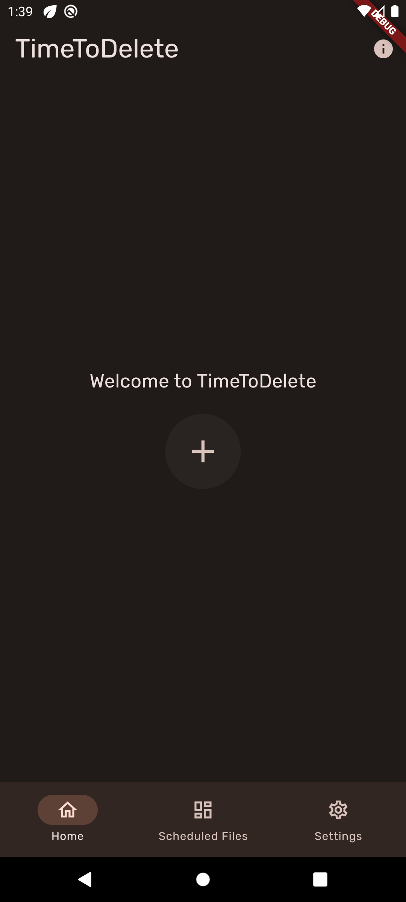
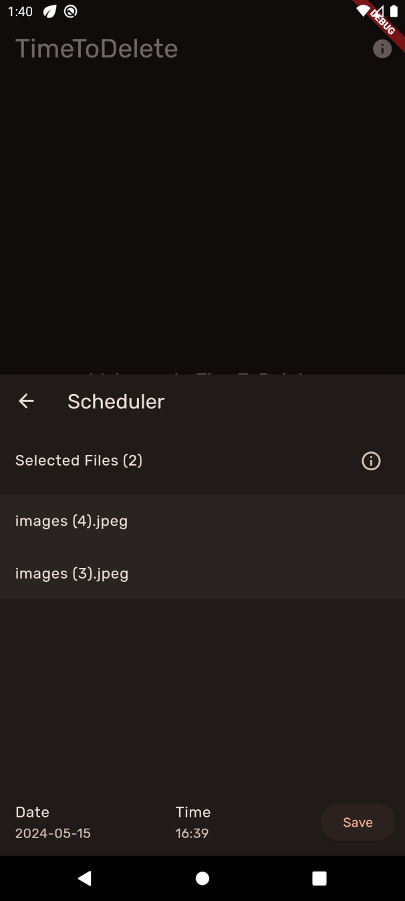
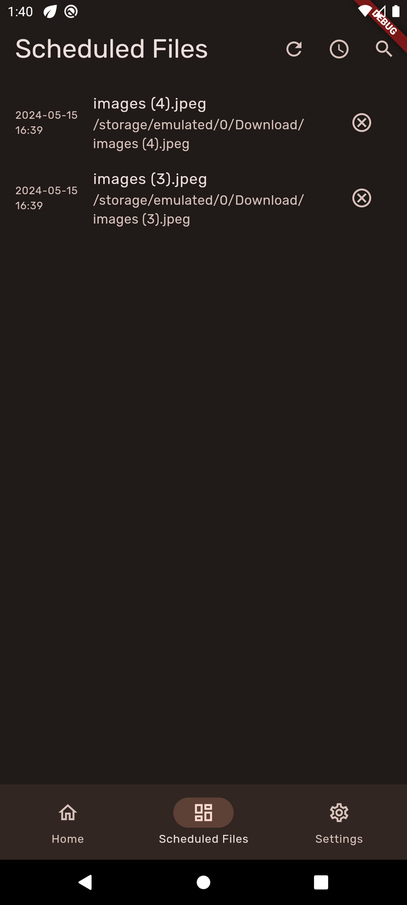

<div align="center">
  <h1>TimeToDelete - Schedule Out Clutter</h1>
</div>


<div align="center">
  <kbd>
    
  </kbd>
</div>


TimeToDelete is a cutting-edge Android application built with Flutter, designed to streamline the management of device storage through the scheduled deletion of files. This intuitive app allows users to mark files for deletion at specified times, ensuring that unnecessary clutter is removed efficiently, keeping your device clean and your storage optimized.

## Features

- **Scheduled Deletions**: Mark files for deletion and set a timer for when you want them removed automatically.
- **Storage Optimization**: Automatically manage and optimize your device storage without manual clean-ups.
- **User-Friendly Interface**: Navigate through a clean, intuitive interface to easily manage your files.
- **Customizable**: Tailor the deletion schedules according to your needs and preferences.
- **Notifications**: Get notified before files are scheduled to be deleted, giving you control over the deletion process.

<details>
  <summary>Screenshots</summary>
  
  <div align="center">
    
    <p><em>Home Screen</em></p>
  </div>

  <div align="center">
    
    <p><em>Scheduling</em></p>
  </div>

  <div align="center">
    
    <p><em>Scheduled Files</em></p>
  </div>

</details>


## Getting Started

This section will guide you through getting a copy of the project up and running on your local machine for development and testing purposes. As TimeToDelete is currently in development, specific installation instructions will be provided upon the app's completion.

### Prerequisites

What things you need to install the software and how to install them:

```bash
flutter
android studio or VS Code
